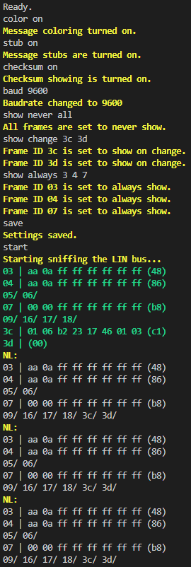
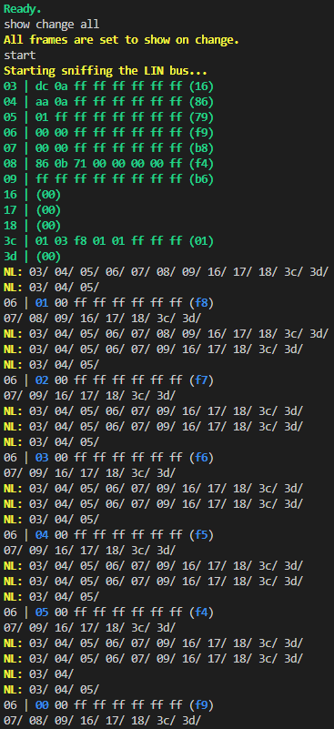

# Arduino DUE based LIN sniffer
This is a program developed to analyse LIN messages.
The messages are reported back over serial.
Filter and verbosity settings can be changed with serial commands.

Uses the [Due Flash Storage](https://github.com/sebnil/DueFlashStorage) library to save settings.

# Connections
* D19 (RX1) - LIN RX

# Command list
* *start*
Starts reporting of the messages. Takes no arguments.
* *stop*
Stops reporting of the messages. Takes no arguments.
* *baud*
Changes the LIN baudrate.
Arguments:
    * Baudrate - value between *1000* and *20000*.
* *show*
Changes how the frames are reported.
Arguments:
    * Verbosity - *always*, *change* or *never*.
    * Frames - *all* or listed frame IDs, e.g. *10 23 1A 3c 3d* 
* *stub*
Controls whether ignored frames are shown ar stubs (only ID) or not reported at all.
Arguments:
    * State - *on* or *off*.
* *checksum*
Controls whether checksum bytes are shown.
Arguments:
    * State - *on* or *off*.
* *color*
Controls whether ANSI escape codes are used to color messages.
Arguments:
    * State - *on* or *off*.
* *save*
Saves the actual settings in flash memory. Takes no arguments.

# Example use

